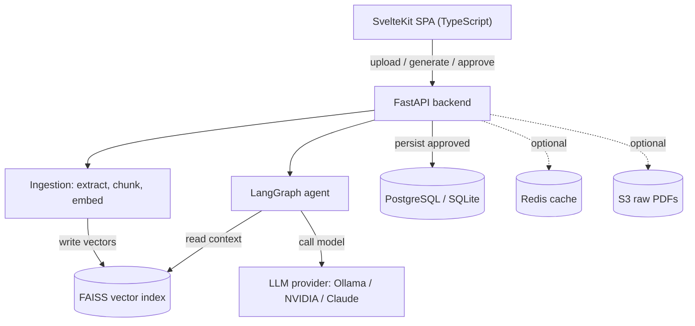
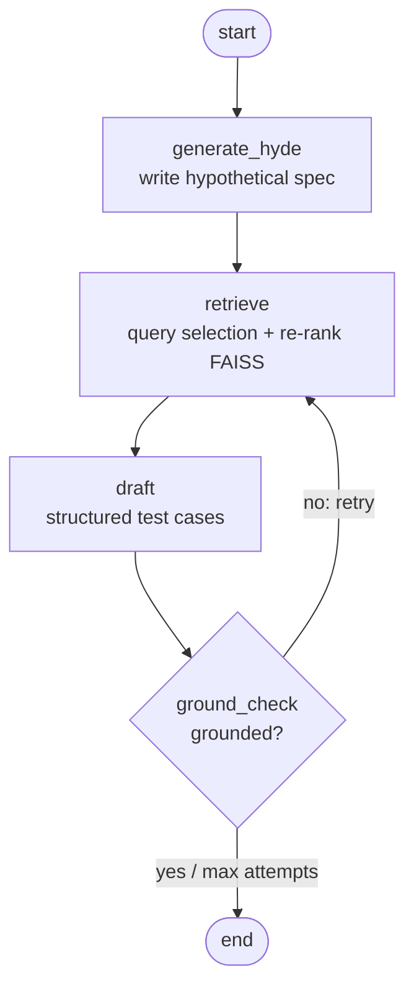

# Architecture

TestGenRAG turns a PDF plus a plain-language requirement into structured,
citation-backed test cases that a human reviews and e-signs. This document
explains the moving parts, how data flows through them, and why each technology
was chosen.

## System overview

Two operations flow through one FastAPI backend: **ingesting** documents and
**generating** test cases. Ingestion writes vectors into a FAISS index; the
agent reads that index and calls a pluggable LLM provider.

## End-to-end flows

**Ingest a document.** The backend extracts the PDF text page by page, splits
each page into overlapping ~1000-character chunks, embeds every chunk into a
384-dimension vector, and stores the vectors in a FAISS index on disk. The page
number travels with each chunk as metadata, which is what later lets a test case
cite "p.3." 

**Generate test cases.** The agent rewrites the requirement into a hypothetical
spec paragraph (HyDE), searches FAISS for relevant chunks, drafts test cases
grounded only in those chunks, then runs a second model pass that checks whether
every claim traces back to the retrieved text. If not, it retrieves more and
retries. Results return as structured cards (title, priority, steps, citations)
for human review and e-sign; signing persists the case as the system of record.

## The agent (LangGraph state graph)

The pipeline is a state graph, not a linear chain, because it needs to loop:
check the draft and go back to retrieval if it is not grounded.

- `generate_hyde` — HyDE (Hypothetical Document Embeddings). A short requirement
  embeds far from the dense spec text that answers it, so the model first writes
  a hypothetical compliant-spec paragraph and we search with that, because it
  lands closer to the real documentation.
- `retrieve` — query selection (search with the HyDE paragraph, the raw
  requirement, and a keyword distillation, then union the hits) plus re-ranking
  (MMR for relevance-vs-diversity, or a page-type boost for spec/table pages).
  On a retry it widens `k`.
- `draft` — produces a `TestSuite`. Structured-output providers use native
  `with_structured_output`; text-only providers get a strict-JSON prompt and a
  tolerant parser. Both paths validate against the same Pydantic schema, so the
  frontend always receives the same shape.
- `ground_check` — LLM-as-judge. A second pass answers yes/no on whether every
  expected result traces to the context; a "no" (under the attempt cap) loops
  back to `retrieve`.

State is a typed dict (`AgentState`) holding the requirement, HyDE doc, context,
test cases, the grounded verdict, and an attempts counter. Each node returns a
partial update that LangGraph merges into the shared state.

## Components and why each was chosen

| Component | File | What it does | Why this choice |
|---|---|---|---|
| Frontend | `frontend/` | Svelte 5 + TypeScript SPA; upload, generate, review, e-sign | Compiler-based, tiny bundle, no VDOM; TS for type safety; `adapter-static` makes it hostable anywhere or servable by FastAPI |
| API | `backend/app/main.py` | FastAPI endpoints `/ingest /generate /approve /approved /health` | Async, auto OpenAPI docs, Pydantic validation, dependency-injected auth |
| PDF extraction | `extractors.py` | PyPDF / PDFPlumber / Docling + page classification | Real documents vary; tables extract poorly with a naive reader, so extraction is pluggable |
| Chunking | `ingestion.py` | Split pages into overlapping chunks | Retrieval works on focused passages; overlap keeps boundary-spanning facts intact |
| Embeddings | `llm.py` | `all-MiniLM-L6-v2` (384-d), local | Free, fast, offline — nothing leaves the machine; swappable to OpenAI |
| Vector store | `ingestion.py` | FAISS index, persisted to disk | In-process, free, no server; switch index type for scale |
| Agent | `agent.py` | LangGraph HyDE → retrieve → draft → judge with retry | A cyclic graph models the self-correction loop a plain chain cannot |
| Retrieval | `retrieval.py` | Query selection + MMR / page-type re-rank | Widen recall, avoid near-duplicate chunks, surface spec tables |
| Schemas | `schemas.py` | Pydantic `TestCase` / `TestSuite` contract | One contract, validated whether output is native or parsed |
| Model layer | `llm.py` | Provider factory (Ollama / NVIDIA / Claude / OpenAI / Bedrock) | No lock-in; switch local-free ↔ hosted-free ↔ best-quality by env var |
| Cache | `cache.py` | Redis with in-memory fallback | Skip recomputing identical requirements; shared across instances |
| Database | `database.py` | PostgreSQL via SQLAlchemy, SQLite fallback | Approved set is the durable audit trail / system of record |
| Auth | `auth.py` | JWT for AWS Cognito and Okta/SAML (OIDC), disabled by default | Enterprise SSO when needed; gated so demos need no login |
| Object storage | `aws.py` | Store raw PDFs in S3, no-op if unset | Keep originals for re-processing / audit |

## Two design decisions worth calling out

**One data contract, two enforcement paths.** Different providers differ in
capability. Structured-output models (Claude, OpenAI, Bedrock) use the
provider's native tool-calling to force schema-valid JSON. Text-only models
(Ollama, NVIDIA NIM) get a strict-JSON prompt and a tolerant parser that strips
reasoning blocks and code fences, extracts the outermost JSON object, validates
it against the Pydantic `TestSuite`, and falls back to a single readable card if
all else fails. The frontend therefore always receives identical structured
cards regardless of which model is running.

**Graceful degradation.** Every external dependency (Redis, PostgreSQL, S3,
auth, hosted LLMs, heavy extractors) is gated behind an environment variable and
falls back to a zero-config default. The same codebase runs as a free offline
demo and as a full enterprise deployment, with each dependency being progressive
enhancement rather than a hard requirement.

## Configuration

All behavior is driven by environment variables (see `backend/.env.example`).
Key switches: `LLM_PROVIDER`, `EMBEDDINGS_PROVIDER`, `PDF_EXTRACTOR`,
`RERANK_METHOD`, and the optional `REDIS_URL`, `DATABASE_URL`, `AUTH_ENABLED`,
`S3_BUCKET`.

## Deployment

Ollama cannot run on free hosting tiers, so cloud deploys switch `LLM_PROVIDER`
to NVIDIA NIM (free hosted models). A single multi-stage Docker image builds the
SvelteKit frontend and serves it together with the API on one port, so the whole
product is one URL. See `DEPLOY.md` for the step-by-step guide.
