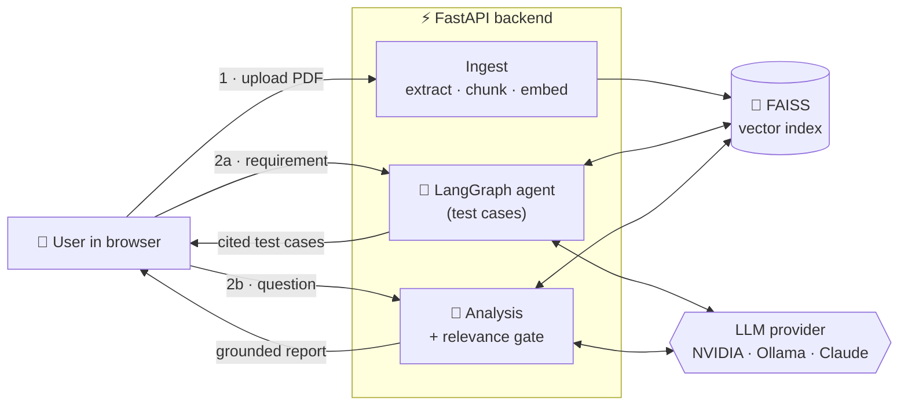
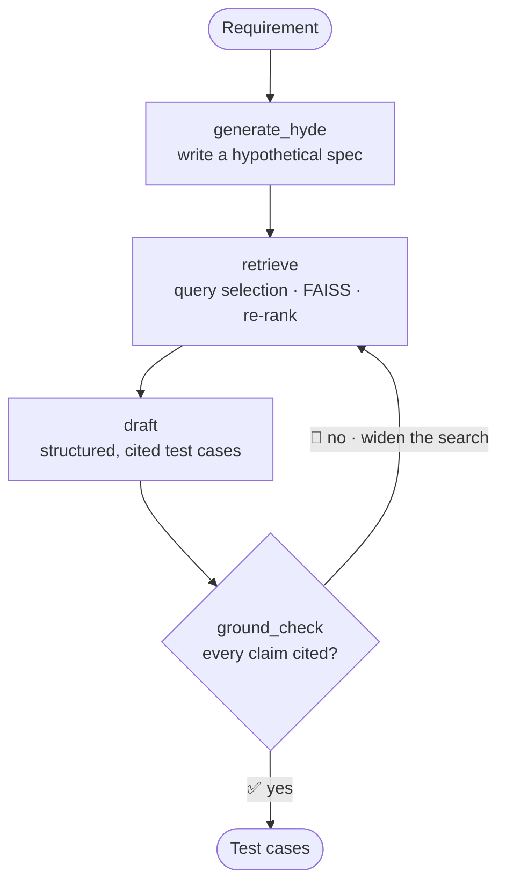
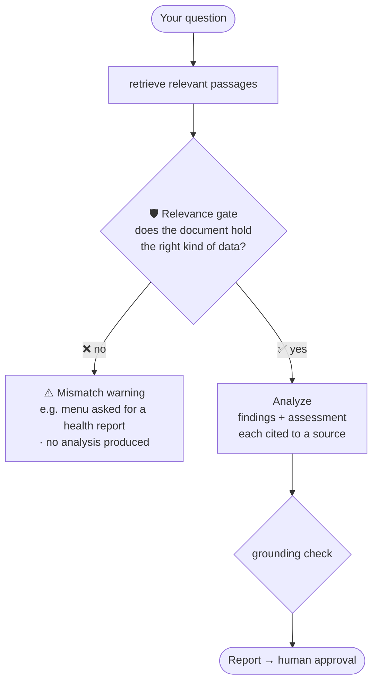

<div align="center">

# ⚗ TestGenRAG

**An agentic RAG assistant that reads your technical documents, then either drafts citation-backed test cases or answers questions about them, with a human approval step and a guardrail that refuses to answer from the wrong document.**

[](https://afnansadiq-testgenrag.hf.space/app)
[](LICENSE)
[](https://www.python.org/)
[](https://nodejs.org/)


[](https://github.com/smafnan/TestGenRag/actions/workflows/ci.yml)

**[▶ Try the live demo](https://afnansadiq-testgenrag.hf.space/app)** · [Architecture](ARCHITECTURE.md) · [Deployment guide](DEPLOY.md)

</div>

---

## What is this?

In regulated and safety-critical fields (medical devices, avionics, automotive, industrial control), every test case has to be **traceable** back to the documentation it verifies. Writing them by hand is slow, and asking a plain chatbot is risky because it makes things up.

**TestGenRAG** solves this with retrieval-augmented generation and a small agent. You upload your documents, and the system:

1. **Drafts formal test cases** where *every expected result cites the exact source passage it came from*, or
2. **Analyzes the document to answer a question** (for example, reading a blood test to assess a patient's results),

and in both cases a second AI pass verifies the output is grounded in the source, a **human reviews and approves** it, and you can **download the result** as a ready-to-use file.

It is **model-agnostic** (Llama, Mistral, Claude, GPT, or fully local Ollama) and runs **free and offline by default**.

> 💡 **No installation needed to try it:** open the [live demo](https://afnansadiq-testgenrag.hf.space/app), paste a free [NVIDIA API key](https://build.nvidia.com), upload a PDF, and go. Your key is used only for your request and is never stored.

---

## ✨ Key features

| | Feature | What it does |
|---|---|---|
| 🧪 | **Test-case generation** | Drafts 2-5 structured test cases (title, priority, preconditions, steps, expected results) for a requirement, each tied to a cited source page. |
| 🔬 | **Document analysis** | Answers a question about the document with a structured report: findings, assessment, recommendation, and caveats, every point cited. |
| 🛡️ | **Relevance gate** | Detects when the uploaded document does not match the question (e.g. a restaurant menu uploaded for a health report) and refuses rather than hallucinate. |
| ⚖️ | **LLM-as-judge** | A second model pass checks that every claim traces to the retrieved source; if not, the agent retrieves more and retries. |
| ✍️ | **Human in the loop** | Nothing counts as output until a reviewer approves and e-signs it. |
| 📤 | **Export** | Download approved test cases as a Markdown test plan or a CSV for import into Jira / TestRail, and analysis as a Markdown report. |
| 🔑 | **Bring your own key** | Visitors enter their own model API key in the UI, nothing to configure server-side, no shared quota. |
| 🎛️ | **Model picker** | Choose any supported model (Llama 3.1 / 3.3, Mistral, Nemotron, or a custom ID) right in the interface. |
| 📡 | **Live pipeline view** | Watch the agent's steps as they run, then click any step to see exactly what it did. |

Every heavy or external integration (Redis, PostgreSQL, S3, auth, hosted LLMs) is **optional and gated**. The app runs end to end with zero external services using Ollama + local embeddings + SQLite.

---

## 🎬 How it works

### The big picture

Two flows share one FastAPI backend and one FAISS index. The SvelteKit UI talks to the same-origin API.



### Flow A - the test-case agent

This is a true **cyclic agent graph**, not a linear chain: if the grounding check fails, it loops back and retrieves more context before trying again.



- **HyDE** generates a hypothetical answer document from the requirement and embeds that for retrieval, matching the target document's wording far better than the raw question, so retrieval is sharper.
- **Retrieve** runs query selection, FAISS similarity search, and re-ranking.
- **Draft** produces structured cases using *only* the retrieved context.
- **Ground check** is the judge; on failure the loop widens `k` and retries (capped).

### Flow B - document analysis with the relevance gate

The gate is the part that makes this trustworthy. It checks whether the document holds the *kind of data* the question needs (not whether the answer is already written out), so a blood test passes a health question, but a menu does not.



---

## 🧭 Using the app (step by step)

1. **Get a free key.** Sign up at [build.nvidia.com](https://build.nvidia.com) (no credit card) and copy your `nvapi-...` key.
2. **Paste the key** into the field at the top of the app and **pick a model** (Mistral is a good, fast default).
3. **Upload a PDF** (a requirements spec, a manual, a lab report, anything). It is extracted, chunked, embedded, and indexed.
4. Type your requirement or question and choose an action:
   - **▶ Generate test cases** for a requirement you want verified.
   - **🔬 Analyze & answer** for a question about the document.
5. **Watch the pipeline** run live, then click any step to inspect the hypothetical spec, the retrieved passages, or the verdict.
6. **Review and approve.** Read the drafted cases or the analysis, then **approve & e-sign** the ones you accept.
7. **Download** your test plan (`.md` / `.csv`) or analysis report (`.md`).

---

## 🧱 Tech stack

| Layer | Technologies |
|---|---|
| **Frontend** | SvelteKit · TypeScript · responsive single-page UI (static-adapter build, served by the API) |
| **Backend / AI** | Python · FastAPI · LangChain · LangGraph · RAG (HyDE, query selection, re-ranking, LLM-as-judge) · FAISS |
| **PDF & data** | PyPDF · PDFPlumber · Docling · dynamic page classification |
| **Models** | NVIDIA NIM (Llama, Mistral, Nemotron...) · Anthropic Claude · OpenAI · AWS Bedrock · Ollama (local) · sentence-transformers embeddings |
| **Data & infra** | PostgreSQL (SQLAlchemy, SQLite fallback) · Redis cache (in-memory fallback) · AWS S3 (optional) · Docker |
| **Auth & security** | AWS Cognito / Okta-OIDC JWT verification (disabled by default) |

---

## 🗂️ Project structure

```text
testgenrag/
├── Dockerfile              # multi-stage: builds the UI, then serves API + UI on one port
├── docker-compose.yml      # app (+ optional redis / postgres)
├── render.yaml             # one-click Render deploy
├── backend/
│   ├── requirements.txt
│   ├── .env.example
│   └── app/
│       ├── main.py         # FastAPI: /ingest /generate /analyze /approve /approved /health
│       ├── llm.py          # model-agnostic LLM + embeddings factory (bring-your-own-key)
│       ├── agent.py        # LangGraph: HyDE → retrieve → draft → judge (+ retry loop)
│       ├── analysis.py     # relevance gate → grounded analysis → judge
│       ├── retrieval.py    # query selection + MMR / page-type re-ranking
│       ├── ingestion.py    # PDF → chunks → FAISS
│       ├── extractors.py   # PyPDF / PDFPlumber / Docling + page classification
│       ├── schemas.py      # Pydantic contracts (test cases, analysis report, relevance)
│       ├── cache.py        # Redis cache (in-memory fallback)
│       ├── database.py     # PostgreSQL persistence (SQLite fallback)
│       ├── auth.py         # Cognito / Okta-OIDC JWT (disabled by default)
│       └── aws.py          # S3 raw-file storage (no-op if unset)
└── frontend/               # SvelteKit + TypeScript SPA
```

---

## 🚀 Run locally (free, offline)

**Prerequisites:** Python 3.11+, Node 18+, and [Ollama](https://ollama.com).

```bash
# 0. One-time: pull a local model
ollama pull mistral

# 1. Backend
cd backend
python -m venv .venv && source .venv/bin/activate     # macOS/Linux
# Windows: python -m venv .venv; .venv\Scripts\activate
pip install -r requirements.txt
cp .env.example .env                                  # defaults are fine, no keys needed
uvicorn app.main:app --reload --port 8000             # API docs at http://localhost:8000/docs

# 2. Frontend (new terminal)
cd frontend
npm install
npm run dev                                           # open http://localhost:5173
```

Upload a PDF, type a requirement, and click **Generate test cases** or ask a question and click **Analyze & answer**.

> First run downloads the embedding model (~90 MB) once. With Ollama, the LLM runs entirely on your machine and nothing leaves it.

### 🔀 Choosing a model

The hosted demo lets each visitor pick a model and supply their own key in the UI. For **local development**, set it in `backend/.env`:

| Goal | Setting |
|---|---|
| Local & free (default) | `LLM_PROVIDER=ollama` |
| Hosted & free | `LLM_PROVIDER=nvidia_deepseek` + `NVIDIA_API_KEY=nvapi-...` |
| Best quality | `LLM_PROVIDER=anthropic` + `ANTHROPIC_API_KEY=...` |

The same idea applies to `PDF_EXTRACTOR` (`pypdf` / `pdfplumber` / `docling`) and `RERANK_METHOD` (`mmr` / `page_type` / `none`).

---

## ☁️ Deploy it online

Ollama cannot run on free hosting, so cloud deploys use a **free hosted model via NVIDIA NIM**. Full walkthrough in [`DEPLOY.md`](DEPLOY.md). Short version:

**Hugging Face Spaces (recommended, 16 GB RAM free, one public URL):**

1. Create a new **Space** → SDK: **Docker**.
2. Push this repo to it (`git push`).
3. In **Settings → Variables and secrets**, set `LLM_PROVIDER=nvidia_deepseek` and `EMBEDDINGS_PROVIDER=huggingface`. **Leave `NVIDIA_API_KEY` blank** so every visitor brings their own key.
4. The Space builds the Dockerfile and serves the UI at `/app`.

**Render (alternative):** connect the repo as a Blueprint (`render.yaml`); note the free tier is RAM-limited, so use OpenAI embeddings there (see `DEPLOY.md`).

---

## 🧪 Tests

```bash
cd backend
source .venv/bin/activate
pip install -r requirements-test.txt
pytest -q
```

The suite stubs the model layer (deterministic fake embeddings + a fake LLM) so the **full pipeline** (extraction → FAISS → agent graph → JSON parsing → `/ingest` + `/generate` + `/analyze` + `/approve`) runs with **no network calls**. The same tests run on every push via GitHub Actions.

---

## ⚠️ Responsible use

The analysis feature reports what a document **says** and how values compare to reference ranges **present in that document**. It is an automated reading to assist a qualified reviewer, not a medical diagnosis, legal opinion, or financial advice, and it never prescribes treatment. The relevance gate and the mandatory human approval step exist precisely so the tool stays an assistant, not an unattended decision-maker. Always have a qualified professional confirm any consequential conclusion.

---

## 📄 License

MIT. See [`LICENSE`](LICENSE) for details.
